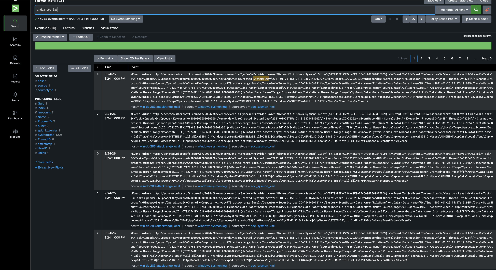
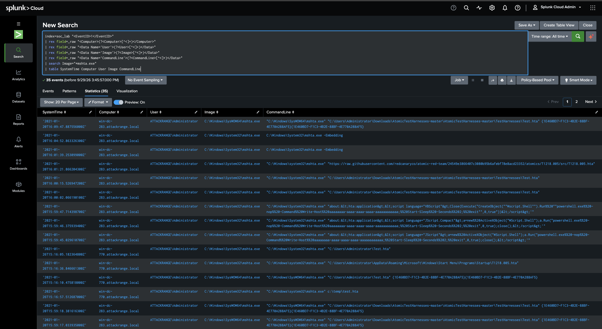
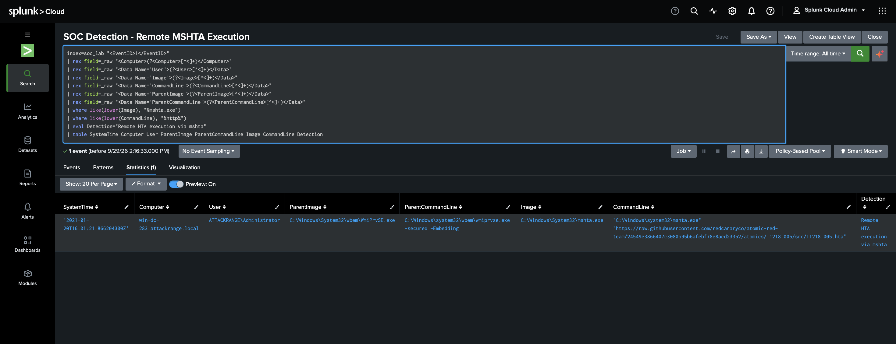
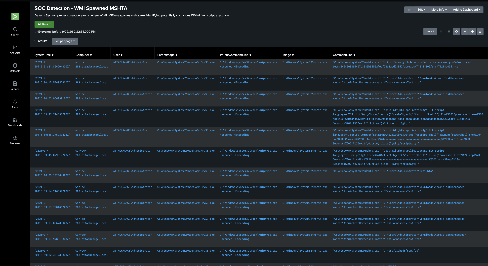
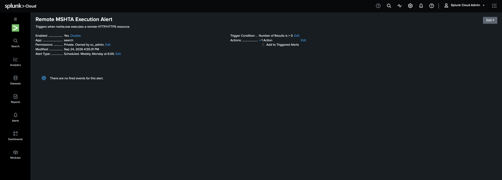

# Splunk SOC Detection & Investigation Lab

## Overview

This project demonstrates a SOC-style investigation using Splunk Cloud and Windows Sysmon telemetry.

The goal was to ingest endpoint security logs, hunt for suspicious process activity, investigate a parent-child execution chain, create reusable SPL detections, configure an alert, and map the findings to MITRE ATT&CK.

The dataset represents controlled Atomic Red Team / Attack Range activity and does not represent a real compromise.

## Tools & Technologies

- Splunk Cloud
- Windows Sysmon telemetry
- SPL (Search Processing Language)
- MITRE ATT&CK
- Splunk Attack Data / Atomic Red Team
- GitHub

## Dataset

A Windows Sysmon attack dataset was uploaded into a dedicated Splunk index:

```text
index=soc_lab
```

Approximately **17,958 Sysmon events** were ingested for investigation.

## Investigation Workflow

The investigation followed this process:

1. Ingest Sysmon telemetry into Splunk.
2. Search for `mshta.exe` activity.
3. Filter for Sysmon Event ID 1 process-creation events.
4. Extract relevant fields from raw XML using SPL.
5. Identify suspicious command-line activity.
6. Analyze parent-child process relationships.
7. Detect remote HTA execution.
8. Create reusable detection searches.
9. Configure a scheduled Splunk alert.
10. Map the behavior to MITRE ATT&CK.

## Key Finding

A suspicious process chain was identified:

```text
WmiPrvSE.exe
      |
      v
  mshta.exe
      |
      v
Remote HTA resource over HTTPS
```

### Affected System

- Host: `win-dc-283.attackrange.local`
- User: `ATTACKRANGE\Administrator`

### Parent Process

```text
C:\Windows\System32\wbem\WmiPrvSE.exe
```

Parent command line:

```text
wmiprvse.exe -secured -Embedding
```

### Child Process

```text
C:\Windows\System32\mshta.exe
```

The `mshta.exe` command line referenced a remotely hosted HTA resource over HTTPS.

## Investigation Results

The investigation narrowed the dataset from thousands of Sysmon events to:

| Finding | Events |
|---|---:|
| Total Sysmon events | 17,958 |
| MSHTA process-creation events | 35 |
| WMI → MSHTA process events | 19 |
| Remote HTTP/HTTPS MSHTA execution | 1 |

## Detection 1 — Remote MSHTA Execution

The first detection identifies `mshta.exe` process creation where the command line references a remote HTTP/HTTPS resource.

```spl
index=soc_lab "<EventID>1</EventID>"
| rex field=_raw "<Computer>(?<Computer>[^<]+)</Computer>"
| rex field=_raw "<Data Name='User'>(?<User>[^<]+)</Data>"
| rex field=_raw "<Data Name='Image'>(?<Image>[^<]+)</Data>"
| rex field=_raw "<Data Name='CommandLine'>(?<CommandLine>[^<]+)</Data>"
| rex field=_raw "<Data Name='ParentImage'>(?<ParentImage>[^<]+)</Data>"
| rex field=_raw "<Data Name='ParentCommandLine'>(?<ParentCommandLine>[^<]+)</Data>"
| where like(lower(Image), "%mshta.exe")
| where like(lower(CommandLine), "%http%")
| eval Detection="Remote HTA execution via mshta"
| table SystemTime Computer User ParentImage ParentCommandLine Image CommandLine Detection
```

Saved in Splunk as:

`SOC Detection - Remote MSHTA Execution`

## Detection 2 — WMI Spawned MSHTA

The second detection identifies situations where Windows Management Instrumentation spawns `mshta.exe`.

```spl
index=soc_lab "<EventID>1</EventID>"
| rex field=_raw "<Computer>(?<Computer>[^<]+)</Computer>"
| rex field=_raw "<Data Name='User'>(?<User>[^<]+)</Data>"
| rex field=_raw "<Data Name='Image'>(?<Image>[^<]+)</Data>"
| rex field=_raw "<Data Name='CommandLine'>(?<CommandLine>[^<]+)</Data>"
| rex field=_raw "<Data Name='ParentImage'>(?<ParentImage>[^<]+)</Data>"
| rex field=_raw "<Data Name='ParentCommandLine'>(?<ParentCommandLine>[^<]+)</Data>"
| where like(lower(Image), "%mshta.exe")
| where like(lower(ParentImage), "%wmiprvse.exe")
| eval Detection="MSHTA spawned by WMI"
| table SystemTime Computer User ParentImage ParentCommandLine Image CommandLine Detection
```

Saved in Splunk as:

`SOC Detection - WMI Spawned MSHTA`

## Alerting

A scheduled Splunk alert was created:

`Remote MSHTA Execution Alert`

Trigger condition:

```text
Number of Results > 0
```

The alert demonstrates how a detection search can be converted into a repeatable monitoring workflow.

Because this project uses historical lab telemetry, the alert is intended to demonstrate detection engineering rather than represent a live production alert.

## MITRE ATT&CK Mapping

The observed activity maps to:

- **T1218.005 — System Binary Proxy Execution: Mshta**
- **T1047 — Windows Management Instrumentation**

## Analyst Assessment

The activity is suspicious because `mshta.exe` is a legitimate Windows utility capable of executing HTA and script content.

Execution of remotely hosted content can be abused to proxy malicious code through a trusted Windows binary.

The observed `WmiPrvSE.exe → mshta.exe` process chain adds additional context suggesting WMI-driven execution.

## Recommended Response

If similar activity were identified in a production environment:

1. Investigate the remote URL and retrieved content.
2. Review surrounding Sysmon, PowerShell, and WMI activity.
3. Validate whether the user initiated the activity.
4. Isolate the endpoint if malicious execution is confirmed.
5. Search other endpoints for the same indicators and process chain.
6. Review the affected account for signs of compromise.
7. Block confirmed malicious indicators.

## Skills Demonstrated

- Splunk Cloud
- SPL searching
- Sysmon log analysis
- Windows process investigation
- Parent-child process analysis
- Detection engineering
- Alert creation
- Command-line analysis
- MITRE ATT&CK mapping
- Incident investigation
- Security monitoring

## Project Evidence

### Sysmon Data Ingestion



### MSHTA Threat Hunt



### Remote MSHTA Detection



### WMI Spawned MSHTA Detection



### Splunk Alert



## Supporting Files

- [Remote MSHTA Detection SPL](detections/remote-mshta-execution.spl)
- [WMI Spawned MSHTA Detection SPL](detections/wmi-spawned-mshta.spl)
- [Incident Investigation Report](findings/incident-investigation.md)

## Disclaimer

This project was completed in a controlled cybersecurity lab using simulated attack telemetry. It does not represent a real-world compromise or unauthorized activity.
